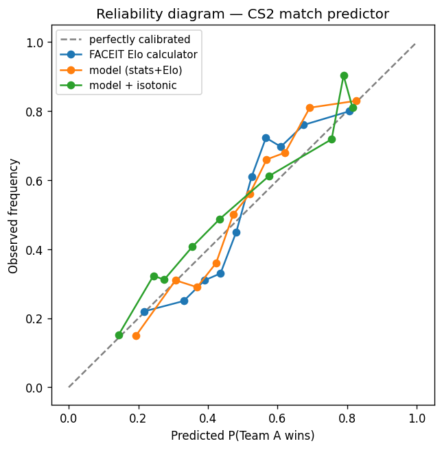

# CS2 Match Predictor

Predict the winner of a Counter-Strike 2 match from the 10 players' FACEIT
usernames. Enter two teams of five; the app combines each team's **average
FACEIT Elo** with their **recent-form stats** (K/D, ADR, headshot %, win rate)
and returns a **calibrated** win probability.

**Live:** https://cs2-match-predictor.onrender.com
(free tier — the first request after it's been idle takes ~30s to wake up)

Built end-to-end: a **leakage-safe ML pipeline** (FACEIT API → features → model
→ evaluation) and a **Django web app** with a caching layer and persistence,
both sharing the same prediction core.

---

## Methods

Most "predict the winner" projects quietly leak future information and report
implausibly high accuracy. This one is deliberately rigorous and reports the
honest result.

- **Leakage-safe by construction.** A match's stat features use *only* each
  player's matches that finished **before** that match
  (`src/faceit_api.py::features_before`).
- **Out-of-time evaluation.** A chronological train/test split — the model is
  always scored on matches newer than everything it trained on.
- **A real baseline, not a coin flip.** The model is benchmarked against the
  **FACEIT Elo calculator** (the standard Elo win-probability formula on each
  player's current Elo) — a genuinely strong baseline to beat.
- **Significance testing.** Differences in AUC are tested with a **paired
  bootstrap confidence interval** and **DeLong's test**, so "better" means
  statistically better, not noise (`src/evaluate.py`).
- **Calibration.** Beyond ranking, the probabilities are measured with log-loss,
  Brier score and **Expected Calibration Error (ECE)**, and sharpened with
  **isotonic regression** (reliability diagram below).
- **Honest result.** FACEIT Elo turns out to be a near-complete predictor:
  recent-form stats — and four other orthogonal features that were tested and
  rejected — add no statistically significant *ranking* value. The model's real,
  measured edge over the raw Elo formula is **calibration**.

## Results

On **2,091 real FACEIT matches** (chronological split; 419 held-out test matches
the model never saw during training):

| Predictor | Accuracy | AUC | Calibration (ECE) |
|---|---|---|---|
| **Our model** (stats + FACEIT Elo, isotonic-calibrated) | 78% | **0.843** | **0.078** |
| FACEIT Elo formula (baseline) | 79% | 0.841 | 0.187 |

The model is about as accurate as FACEIT Elo on ranking, but its probabilities
are far better **calibrated** (ECE 0.19 → 0.08 — a "70%" really wins ~70% of the
time). These figures are shown live on the site and regenerated on every retrain.



> ~78% accuracy reflects that real matchups are often lopsided (easy to call from
> the Elo gap). On *evenly matched* teams accuracy is closer to ~60% — the honest
> ceiling for this problem.

## Architecture

```
                ┌─────────────────────────────────────────┐
                │  src/  (framework-agnostic ML library)   │
                │  faceit_api · features · dataset · elo    │
                │  train · evaluate · predict              │
                └───────────────┬─────────────────────────┘
                                │ predict_from_stats()
                  ┌─────────────┴─────────────┐
                  │                           │
          ┌───────▼──────┐            ┌───────▼───────┐
          │  Django app  │            │  CLI (python  │
          │ (config/ +   │            │  -m src.*)    │
          │  predictor/) │            └───────────────┘
          │ cache · DB · │
          │ tests        │
          └──────────────┘
```

The ML logic lives in `src/` and knows nothing about the web. The Django app is
a thin layer over it that adds production concerns.

### Scaling decision: caching the slow external API

A single prediction makes **10 calls** to the rate-limited FACEIT API (~5–6s
cold). The Django service caches each player's stats, so repeat predictions are
served from memory:

| | Cold (live FACEIT) | Warm (cached) |
|---|---|---|
| Time for a prediction | ~5.6 s | ~0.05 s (**~100× faster**) |

In production this in-memory cache would move to Redis, and the FACEIT fetches
into a background worker so requests never block.

## Project structure

```
src/                    # ML library (no web dependencies)
  faceit_api.py         #   FACEIT client + leakage-safe stat aggregation
  features.py           #   team-difference + Elo-gap feature vectors
  dataset.py            #   builds labeled data (snowball crawl over the player graph)
  elo.py                #   FACEIT-Elo snapshot + from-scratch leakage-free Elo replay
  train.py              #   chronological split, trains, isotonic-calibrates, saves model
  evaluate.py           #   model vs Elo calculator vs naive: AUC/log-loss/Brier/ECE
                        #   + paired-bootstrap & DeLong significance + calibration report
  predict.py            #   matchup → win probability
config/                 # Django project (settings, urls)
predictor/              # Django app: views, forms, services (cache+model+metrics), tests
data/processed/         # committed: matches.csv, best_model.joblib, elo_features.csv, metrics.json
reports/                # reliability diagram
```

## Getting started

```bash
# 1. Setup
python3 -m venv .venv
.venv/bin/pip install -r requirements.txt

# 2. FACEIT API key (free, from developers.faceit.com)
cp .env.example .env        # then set FACEIT_API_KEY=...

# 3. Run the Django web app
.venv/bin/python manage.py migrate
.venv/bin/python manage.py runserver      # http://localhost:8000

# 4. Or use the CLI
.venv/bin/python -m src.predict \
  --team-a='name1,name2,name3,name4,name5' \
  --team-b='name6,name7,name8,name9,name10'
```

Rebuild the dataset and model from scratch (needs the API key):

```bash
# crawl matches, build Elo features, train (isotonic-calibrated), evaluate
.venv/bin/python -m src.dataset --seed='<nickname>' --target=2500 --per-player=30
.venv/bin/python -m src.elo --data data/processed/matches.csv
.venv/bin/python -m src.train
.venv/bin/python -m src.evaluate                 # model vs Elo vs naive + significance
.venv/bin/python -m src.evaluate --metrics       # refresh the site's track-record table

# calibration report + reliability diagram (matplotlib is dev-only)
.venv/bin/pip install -r requirements-dev.txt
.venv/bin/python -m src.evaluate --calibration
```

Run the tests:

```bash
.venv/bin/python manage.py test predictor
```

## Limitations & future work

- **More data.** 2,091 matches gives a ~419-match test set; a larger crawl would
  tighten the confidence intervals further.
- **Remaining feature ideas.** Per-map skill and momentum/recent-trend are the
  orthogonal signals not yet tested (they need richer per-match history).
- **Live backtest.** Continuously validate on newly finished matches for a
  rolling, always-current accuracy figure.

## Tech stack

Python · scikit-learn · XGBoost · pandas · Django · FACEIT Data API
