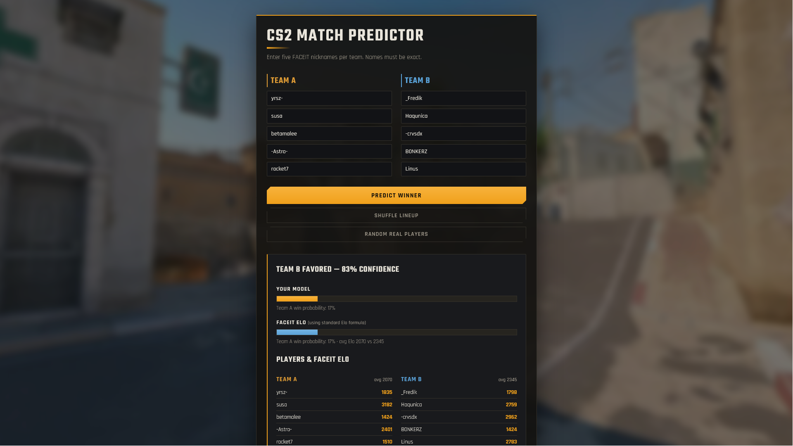

# CS2 Match Predictor

**Do recent-form stats predict Counter-Strike matches any better than raw skill
rating alone? I built the pipeline to answer that properly — and the answer is
no. Here is how I know.**

Enter ten FACEIT usernames, five per team, and the app returns a **calibrated**
win probability. Behind it: a **leakage-safe ML pipeline** (FACEIT API →
features → model → evaluation) and a **Django web app**, sharing one scoring
path.

**Live:** https://cs2-match-predictor.onrender.com
(free tier — the first request after it's been idle takes ~30s to wake up)



---

## The finding

On 5,000 real FACEIT matches, **FACEIT Elo turns out to be a near-complete
predictor.** Recent-form stats (K/D, ADR, headshot %, win rate) — plus four
further orthogonal features built and tested, including a leakage-safe teammate
"stacking" signal that separates a coordinated 5-stack from five strangers at
the same rating — add **no statistically significant ranking value** on top of
it:

> **AUC +0.007** over the Elo formula · 95% CI **[−0.001, +0.016]** ·
> DeLong **p = 0.09** → not significant at 5%

That is a negative result, and reporting it is the point. Most "predict the
winner" projects quietly leak future information into their features and report
implausibly high accuracy. This one is leakage-safe by construction, scored
out-of-time, and significance-tested — which is exactly why it reports a
smaller number that happens to be real.

**Where the model does win is calibration.** Isotonic regression takes Expected
Calibration Error from **0.072 → 0.032**: a "70%" from this model really wins
about 70% of the time, which the raw Elo formula cannot claim. For anything you
would actually *do* with a probability, that is the property that matters.

## Results

On **5,000 real FACEIT matches** (chronological split; the newest 1,000 are
held-out test matches the model never saw during training):

| Predictor | Accuracy | AUC | Calibration (ECE) |
|---|---|---|---|
| **Our model** (stats + FACEIT Elo, isotonic-calibrated) | 69% | **0.753** | **0.032** |
| FACEIT Elo formula (baseline) | 70% | 0.745 | 0.072 |

A **walk-forward backtest** (8 expanding-window folds, 4,440 out-of-sample
predictions) confirms the same picture: model AUC 0.744 vs Elo 0.743, with the
calibration edge intact (ECE 0.033 vs 0.065). These figures are shown live on
the site and regenerated on every retrain.


> ~70% accuracy reflects that arbitrary matchups are often lopsided (easy to
> call from the Elo gap). On *evenly matched* teams accuracy is closer to ~60% —
> the honest ceiling for this problem.

## How the number is kept honest

The finding above is only worth anything if the evaluation is trustworthy, so
that is where most of the work went.

- **Leakage-safe by construction.** A match's stat features use *only* each
  player's matches that finished **before** that match
  (`src/faceit_api.py::features_before`).
- **Out-of-time evaluation.** A chronological train/test split — the model is
  always scored on matches newer than everything it trained on.
- **A real baseline, not a coin flip.** The model is benchmarked against the
  **FACEIT Elo calculator** (the standard Elo win-probability formula on each
  player's current Elo) — a genuinely strong baseline to beat.
- **Significance testing.** Differences in AUC are tested with a **paired
  bootstrap confidence interval** and **DeLong's test**, so "better" means
  statistically better, not noise (`src/evaluate.py`).
- **Calibration measured, not assumed.** Probabilities are scored with
  log-loss, Brier score and **Expected Calibration Error**, then sharpened with
  **isotonic regression** (reliability diagram above).
- **Cross-checked leakage-free.** Because FACEIT exposes only *current* Elo, the
  Elo feature is a crawl-time snapshot; the same comparison is re-run against a
  from-scratch **Elo replay** computed chronologically from match results
  (`src/elo.py::replay`), which has no look-ahead at all.

## Architecture

```
                ┌─────────────────────────────────────────┐
                │  src/  (framework-agnostic ML library)   │
                │  faceit_api · features · dataset · elo    │
                │  train · evaluate · predict              │
                └───────────────┬─────────────────────────┘
                                │ predict_from_stats()
                  ┌─────────────┴─────────────┐
                  │                           │
          ┌───────▼──────┐            ┌───────▼───────┐
          │  Django app  │            │  CLI (python  │
          │ (config/ +   │            │  -m src.*)    │
          │  predictor/) │            └───────────────┘
          │ cache · DB · │
          │ tests        │
          └──────────────┘
```

The ML logic lives in `src/` and knows nothing about the web. The Django app is
a thin layer over it that adds production concerns.

The CLI and the web app score through the same `predict_from_stats()`, and
dataset-building and inference construct their feature rows from the same
primitives in `src/features.py` against one shared `MODEL_FEATURE_COLS` column
list and order — so a feature vector means the same thing at training time and
at serving time, by construction rather than by discipline.

### Scaling decision: caching the slow external API

A single prediction makes **10 calls** to the rate-limited FACEIT API (~5–6s
cold). The Django service caches each player's stats, so repeat predictions are
served from memory:

| | Cold (live FACEIT) | Warm (cached) |
|---|---|---|
| Time for a prediction | ~5.6 s | ~0.05 s (**~100× faster**) |

In production this in-memory cache would move to Redis, and the FACEIT fetches
into a background worker so requests never block.

## Project structure

```
src/                    # ML library (no web dependencies)
  faceit_api.py         #   FACEIT client + leakage-safe stat aggregation
  features.py           #   team-difference + Elo-gap feature vectors
  dataset.py            #   builds labeled data (snowball crawl over the player graph)
  elo.py                #   FACEIT-Elo snapshot + from-scratch leakage-free Elo replay
  train.py              #   chronological split, trains, isotonic-calibrates, saves model
  evaluate.py           #   model vs Elo calculator vs naive: AUC/log-loss/Brier/ECE
                        #   + paired-bootstrap & DeLong significance + calibration report
  predict.py            #   matchup → win probability
config/                 # Django project (settings, urls)
predictor/              # Django app: views, forms, services (cache+model+metrics), tests
data/processed/         # committed: matches.csv, best_model.joblib, elo_features.csv, metrics.json
reports/                # reliability diagram
docs/                   # screenshot used in this README
```

## Getting started

```bash
# 1. Setup
python3 -m venv .venv
.venv/bin/pip install -r requirements.txt

# 2. FACEIT API key (free, from developers.faceit.com)
cp .env.example .env        # then set FACEIT_API_KEY=...

# 3. Run the Django web app
.venv/bin/python manage.py migrate
.venv/bin/python manage.py runserver      # http://localhost:8000

# 4. Or use the CLI
.venv/bin/python -m src.predict \
  --team-a='name1,name2,name3,name4,name5' \
  --team-b='name6,name7,name8,name9,name10'
```

Rebuild the dataset and model from scratch (needs the API key):

```bash
# crawl matches, build Elo features, train (isotonic-calibrated), evaluate
.venv/bin/python -m src.dataset --seed='<nickname>' --target=5000 --per-player=30
.venv/bin/python -m src.elo --data data/processed/matches.csv
.venv/bin/python -m src.train
.venv/bin/python -m src.evaluate                 # model vs Elo vs naive + significance
.venv/bin/python -m src.evaluate --metrics       # refresh the site's track-record table

# calibration report + reliability diagram (matplotlib is dev-only)
.venv/bin/pip install -r requirements-dev.txt
.venv/bin/python -m src.evaluate --calibration
```

Run the tests:

```bash
.venv/bin/python manage.py test predictor
```

## Limitations & future work

- **Point-in-time Elo.** FACEIT exposes only each player's *current* Elo, so the
  Elo feature is a snapshot taken at crawl time — mild look-ahead on the oldest
  matches. The dataset spans a few weeks so drift is limited, and the effect is
  smallest on the (newest) test matches, but it is not zero; future crawls
  snapshot Elo immediately.
- **Remaining feature ideas.** Per-map skill and momentum/recent-trend are the
  orthogonal signals not yet tested (they need richer per-match history).
- **Live backtest.** Continuously validate on newly finished matches for a
  rolling, always-current accuracy figure.

## Tech stack

Python · scikit-learn · XGBoost · pandas · Django · FACEIT Data API
